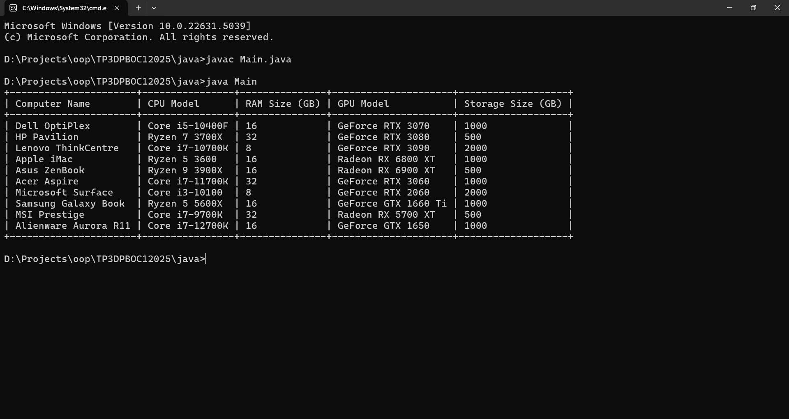

# Desain dan Pemrograman Berbasis Objek

---

## Tugas Praktikum 3

---

### Janji

---

Saya Fariz Wibisono dengan NIM 2307589 mengerjakan Tugas Praktikum 3 dalam mata kuliah Desain dan Pemrograman Berorientasi Objek untuk keberkahanNya maka saya tidak melakukan kecurangan seperti yang telah dispesifikasikan. Aamiin.

### Dokumentasi

---

#### Kompilasi

---

Berikut adalah cara untuk mengkompilasi dan menjalankan kode di setiap bahasa pemrograman yang digunakan dalam proyek ini:

1.  **C++**

   ```sh
   g++ -o main main.cpp
   ./main
   ```

2.  **Java**

   ```sh
   javac Main.java
   java Main
   ```

3.  **Python**

   ```sh
   python main.py
   ```

Pastikan Anda berada di direktori yang benar sebelum menjalankan perintah di atas.

#### Diagram Kelas

---

Berikut adalah diagram kelas yang menggambarkan struktur dan hubungan antar kelas dalam proyek ini:


#### Bahasa Pemrograman

---

Proyek ini diimplementasikan dalam beberapa bahasa pemrograman. Berikut adalah hasil run kode di setiap bahasa:

1.  **C++**
   

2.  **Java**
   

3.  **Python**
   

#### Penjelasan Proyek

---

Berikut adalah penjelasan rinci mengenai kelas yang ada pada proyek ini:

1. Konsep Inheritance

---

Dalam proyek ini, konsep _inheritance_ (pewarisan) digunakan untuk merepresentasikan hubungan hierarkis antar komponen dalam sistem komputer. Kelas abstrak `Component` berfungsi sebagai kelas dasar bagi `Hardware` dan `Software`, yang kemudian diturunkan menjadi berbagai kelas turunan spesifik seperti `Motherboard`, `CPU`, `RAM`, `StorageDevice`, serta `OperatingSystem` dan `Application`. Dengan pendekatan ini, atribut umum seperti `manufacturer`, `model`, dan `price` dapat diwarisi oleh kelas turunannya tanpa harus dideklarasikan ulang, yang membuat kode lebih bersih, modular, dan mudah diperluas.

2. Konsep Komposisi

---

Komposisi digunakan untuk menggambarkan hubungan _has-a_ antar komponen dalam sistem komputer. Kelas `Computer` memiliki `Motherboard`, `PowerSupply`, `Cooling`, `BIOS`, `OperatingSystem`, serta daftar `Software` dan `Peripheral`. Dengan pendekatan ini, sistem komputer dapat direpresentasikan secara lebih realistis, di mana setiap komponen memiliki peran spesifik yang bekerja secara bersama-sama. Selain itu, `Motherboard` juga mengandung berbagai perangkat keras seperti `CPU`, `RAM`, `ExpansionCard`, dan `StorageDevice`, yang menunjukkan bagaimana setiap komponen dapat berinteraksi dalam satu sistem yang lebih besar.

3. Penggunaan Array of Objects

---

Proyek ini juga mengimplementasikan konsep _array of objects_ untuk menangani koleksi dari komponen tertentu. Sebagai contoh, kelas `Computer` memiliki atribut `vector<Peripheral*> peripherals`, yang digunakan untuk menyimpan daftar perangkat eksternal seperti keyboard, mouse, dan monitor. Selain itu, `Motherboard` memiliki `vector<RAM*> ramSlots` dan `vector<StorageDevice*> storageSlots`, yang memungkinkan komputer untuk menangani berbagai jenis penyimpanan dan modul memori dengan fleksibel. Pendekatan ini mempermudah pengelolaan banyak objek sekaligus dalam sistem.

4. Kompleksitas dan Rasionalitas Desain

---

Diagram yang digunakan dalam proyek ini mencerminkan desain yang kompleks tetapi terstruktur dengan baik, mencerminkan sistem komputer yang modular dan scalable. Dengan membagi sistem menjadi kelas-kelas yang lebih spesifik berdasarkan fungsinya, desain ini memungkinkan perubahan dan pengembangan lebih lanjut tanpa harus merombak keseluruhan struktur. Selain itu, penggunaan antarmuka seperti `Bootable`, `Upgradable`, `Connectable`, dan `Executable` membantu dalam mendefinisikan perilaku khusus bagi berbagai komponen tanpa harus mengubah hierarki pewarisan, sehingga meningkatkan fleksibilitas desain.

5. Hierarchical, Multiple, dan Hybrid Inheritance

---

Proyek ini mengimplementasikan beberapa jenis pewarisan untuk mendukung modularitas dan fleksibilitas desain. _Hierarchical inheritance_ terlihat pada hubungan antara `StorageDevice` dengan `HDD` dan `SSD`, serta antara `Peripheral` dengan `Monitor`, `Keyboard`, dan `Mouse`. _Multiple inheritance_ diterapkan melalui penggunaan antarmuka seperti `Upgradable`, yang diimplementasikan oleh `RAM`, `Application`, dan `OperatingSystem`. Selain itu, proyek ini juga menerapkan _hybrid inheritance_ dengan menggabungkan pewarisan kelas dan implementasi antarmuka, seperti pada `Computer` yang merupakan turunan dari `Component` serta mengimplementasikan `Bootable`. Pendekatan ini memungkinkan berbagai komponen dalam sistem untuk memiliki karakteristik yang fleksibel sesuai kebutuhan fungsionalnya.

6. Penjelasan Kelas

---

- `Component` adalah kelas dasar untuk semua komponen perangkat keras dan perangkat lunak yang memiliki atribut umum seperti `id`, `manufacturer`, `model`, dan `price`.
- `Hardware` adalah kelas dasar untuk perangkat keras yang memiliki atribut seperti `serialNumber`, `installationDate`, dan `physicallyInstalled`.
- `Software` adalah kelas dasar untuk perangkat lunak yang memiliki atribut seperti `version`, `licenseKey`, dan `sizeMB`.
- `Bootable` adalah interface yang memungkinkan objek untuk melakukan `boot`, `shutdown`, dan `restart`.
- `Upgradable` adalah interface yang memungkinkan objek untuk diupgrade dan didowngrade.
- `Connectable` adalah interface yang memungkinkan objek untuk `connect` dan `disconnect`.
- `Executable` adalah interface yang memungkinkan objek untuk `execute` dan `terminate`.
- `Computer` adalah kelas utama yang merepresentasikan sebuah komputer dengan komponen seperti `motherboard`, `powerSupply`, `cooling`, dan perangkat lunak serta memiliki metode untuk mengelola periferal, perangkat lunak, dan driver serta fitur seperti booting dan upgrade sistem.
- `Motherboard` adalah komponen utama yang menghubungkan `CPU`, `RAM`, kartu ekspansi, dan perangkat penyimpanan.
- `CPU` adalah komponen yang memproses instruksi dengan atribut seperti kecepatan clock, jumlah core, dan jenis arsitektur.
- `RAM` adalah komponen penyimpanan sementara dengan atribut kapasitas, tipe, dan kecepatan.
- `StorageDevice` adalah kelas dasar untuk perangkat penyimpanan seperti `HDD` dan `SSD` dengan atribut kapasitas dan kecepatan baca tulis.
- `HDD` adalah perangkat penyimpanan berbasis piringan dengan atribut tambahan seperti kecepatan putaran (RPM).
- `SSD` adalah perangkat penyimpanan berbasis flash dengan atribut seperti tipe NAND dan TBW (total bytes written).
- `ExpansionCard` adalah kelas dasar untuk kartu ekspansi seperti kartu grafis, kartu jaringan, dan kartu suara.
- `GraphicsCard` adalah kartu grafis dengan atribut VRAM, model GPU, dan jumlah port tampilan.
- `NetworkCard` adalah kartu jaringan dengan atribut seperti alamat MAC, kecepatan maksimum, serta dukungan WiFi dan Bluetooth.
- `SoundCard` adalah kartu suara dengan jumlah kanal, bit depth, dan sample rate.
- `PowerSupply` adalah komponen yang menyediakan daya listrik dengan atribut wattage, sertifikasi, dan modularitas.
- `Cooling` adalah sistem pendingin dengan kapasitas disipasi panas yang terdiri dari `AirCooling` dan `LiquidCooling`.
- `AirCooling` adalah sistem pendinginan berbasis kipas dengan atribut jumlah kipas dan kecepatan RPM.
- `LiquidCooling` adalah sistem pendinginan berbasis cairan dengan atribut volume cairan dan tipe fluida.
- `Peripheral` adalah kelas dasar untuk perangkat eksternal seperti monitor, keyboard, dan mouse.
- `Monitor` adalah layar tampilan dengan atribut ukuran, resolusi, refresh rate, dan tipe panel.
- `Keyboard` adalah perangkat input dengan atribut apakah mekanikal, jenis layout, dan lampu latar.
- `Mouse` adalah perangkat input dengan jumlah tombol, scroll wheel, dan DPI.
- `OperatingSystem` adalah sistem operasi dengan atribut nama, versi kernel, dan arsitektur (32-bit atau 64-bit).
- `Application` adalah perangkat lunak dengan atribut nama, pengembang, dan sistem operasi yang didukung.
- `GameEngine` adalah mesin game dengan atribut nama, versi, platform yang didukung, dan apakah open source.
- `Firmware` adalah perangkat lunak tertanam dalam perangkat keras dengan atribut versi, perangkat yang didukung, dan tanggal rilis.
- `BIOS` adalah firmware dasar komputer yang menangani booting dan memiliki atribut produsen serta tanggal rilis.
- `Driver` adalah perangkat lunak yang memungkinkan komunikasi antara sistem operasi dan perangkat keras.
- `Utility` adalah perangkat lunak utilitas dengan atribut nama dan fungsinya.
